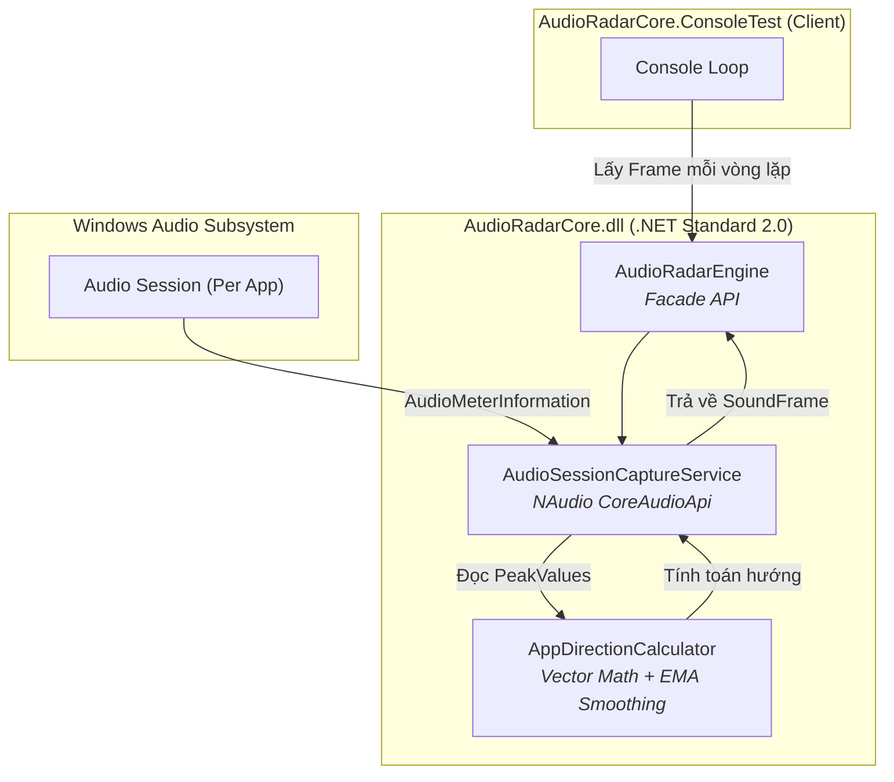

# AudioRadar3D — Implementation Plan (Thực tế)

Phần mềm bắt luồng âm thanh theo từng ứng dụng cụ thể (App-specific audio capture) và tính toán hướng của nguồn âm thanh (2D direction) dựa trên cường độ các kênh âm thanh (Peak meter) — **phiên bản hiện tại tập trung vào Core DLL và Console Test**.

---

## Quyết định thiết kế thực tế

| Yêu cầu | Quyết định |
|---|---|
| **Kiến trúc** | `AudioRadarCore.dll` library + `ConsoleTest` app. (Chưa có project Unity) |
| **Capture API** | `NAudio.CoreAudioApi.AudioSessionManager` (Bắt âm thanh theo từng process/ứng dụng thay vì toàn hệ thống). |
| **Phân tích âm thanh** | Lấy Peak Values trực tiếp từ `AudioMeterInformation`, KHÔNG dùng buffer thô hay DSP/Biquad Filter. |
| **Phân loại âm** | Bị loại bỏ hoặc chưa thực hiện. Chỉ tính toán hướng (Direction) và cường độ (Intensity). |
| **Mô hình xử lý** | Pull-based (Gọi `TryGetLatestFrame` để lấy dữ liệu peak mới nhất), không dùng thread background phức tạp. |

---

## Kiến trúc Tổng quan (Thực tế)



### Tại sao dùng AudioSessionManager thay vì WASAPI Loopback?

| Tiêu chí | Kế hoạch cũ (WASAPI Loopback) | Thực tế (AudioSessionManager) |
|---|---|---|
| Mức độ cách ly | Lẫn lộn âm thanh toàn hệ thống | **Bắt riêng âm thanh của từng Game/App** |
| Phức tạp xử lý | Phải xử lý byte/float array liên tục | **Chỉ cần đọc Peak Values (0.0 -> 1.0)** |
| Hiệu năng CPU | Cần FFT, Filters, Background thread | **Cực kỳ nhẹ, do Windows OS đã tính toán sẵn Peak** |

---

## AudioRadarCore.dll — Class Library

### Public API của DLL

```csharp
// ─── AudioRadarEngine.cs ─── (Facade / Entry point)
public class AudioRadarEngine : IDisposable
{
    public bool IsRunning { get; private set; }
    
    // Điều khiển
    public void Start();
    public void Stop();
    
    // Quản lý thiết bị
    public string[] GetAudioDevices();
    public void SetAudioDevice(int deviceIndex);
    
    // Quản lý Ứng dụng (Sessions)
    public List<(int ProcessId, string ProcessName)> GetActiveSessions();
    public void SetTargetSession(int processId, string processName);
    
    // Lấy kết quả (Pull-based)
    public bool TryGetLatestFrame(out SoundFrame frame);
    
    public event Action<string> OnError;
    public void Dispose();
}
```

### Data Models

```csharp
// ─── SoundEvent.cs ───
public class SoundEvent
{
    public float DirectionX { get; set; }
    public float DirectionY { get; set; }
    public float Intensity { get; set; }
    public float Distance { get; set; }
}

// ─── SoundFrame.cs ───
public class SoundFrame
{
    public long Timestamp { get; set; }
    public string AppName { get; set; }
    public SoundEvent[] Events { get; set; }
}
```

---

## Capture — AudioSessionCaptureService

Class này chịu trách nhiệm:
1. Liệt kê các `MMDevice` (Loa/Tai nghe).
2. Lấy danh sách các ứng dụng đang phát âm thanh thông qua `AudioSessionManager`.
3. Khi người dùng chọn 1 `ProcessId`, hệ thống sẽ chỉ đọc `AudioMeterInformation.PeakValues` của Process đó.
4. Điều này giúp loại bỏ hoàn toàn tạp âm từ các ứng dụng khác (như Discord, Chrome, Spotify) mà không cần bộ lọc phức tạp.

---

## Analyze — AppDirectionCalculator

Thay vì sử dụng các thuật toán FFT hay nhận dạng khuôn mẫu phức tạp, hệ thống hiện tại tính hướng âm thanh dựa trên giá trị Peak của các kênh.

### Logic Stereo (2 Kênh)
- `X = Left - Right` (Tính độ lệch trái/phải).
- `Y = 2.0 * Min(Left, Right)` (Giả lập hướng phía trước dựa trên âm thanh chung ở cả 2 kênh).
- `Magnitude = Sqrt(X^2 + Y^2)`.

### Logic Surround (7.1 Kênh)
Sử dụng `ChannelMapping.cs` để ánh xạ từng kênh với một vector cố định, sau đó tổng hợp các vector này dựa trên Peak Value của từng kênh tương ứng.

### Smoothing (Exponential Moving Average)
Để tránh kim chỉ hướng bị giật lag, kết quả được làm mượt:
`_smoothed = _smoothingAlpha * raw + (1 - _smoothingAlpha) * _smoothed`

---

## Tổng hợp cấu trúc Project thực tế

```
d:\Code\MyCode\AudioRadar3D\
│
├── AudioRadarCore/                       # ── .NET Standard 2.0 Class Library ──
│   ├── AudioRadarCore.csproj
│   ├── AudioRadarEngine.cs               # ★ Public API (facade)
│   ├── Capture/
│   │   ├── AudioDeviceManager.cs
│   │   └── AudioSessionCaptureService.cs # Đọc AudioMeterInformation
│   ├── Analyze/
│   │   └── AppDirectionCalculator.cs     # Tính toán Vector hướng
│   ├── Models/
│   │   ├── SoundEvent.cs
│   │   ├── SoundFrame.cs
│   │   ├── SoundType.cs
│   │   ├── ProfileData.cs
│   │   ├── FilterBandConfig.cs
│   │   └── ChannelMapping.cs
│   └── Config/
│
├── AudioRadarCore.ConsoleTest/           # ── Console App Test ──
│   ├── AudioRadarCore.ConsoleTest.csproj
│   └── Program.cs                        # CLI menu test các tính năng
│
├── AudioRadarCore.Tests/                 # (Chưa rõ tình trạng unit tests)
├── AudioRadar3D.slnx                     # Solution format mới
├── IMPLEMENTATION_PLAN.md                # Tài liệu này
└── README.md
```

---

## Thứ tự triển khai tiếp theo (Đề xuất)

Vì codebase hiện tại đã thay đổi rất nhiều so với kế hoạch ban đầu, dưới đây là các bước tiếp theo cần cân nhắc:

1. **Hoàn thiện Unity App**: Tạo project Unity, import DLL này vào và ánh xạ dữ liệu `DirectionX, DirectionY` lên một UI Radar 2D hoặc 3D đơn giản.
2. **Tối ưu hóa UI/UX**: Xây dựng UI trong Unity để người dùng có thể chọn `Target Session` trực quan thay vì qua Console.
3. **Cải thiện thuật toán (Optional)**: Nếu cần phân loại âm thanh (Footstep/Gunshot), sẽ phải quay lại đọc raw byte stream thông qua WASAPI Loopback (vì AudioMeterInformation chỉ cho giá trị âm lượng peak, không thể phân tích tần số để phân loại).
