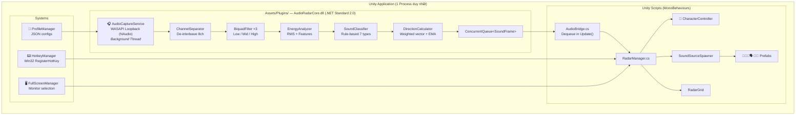
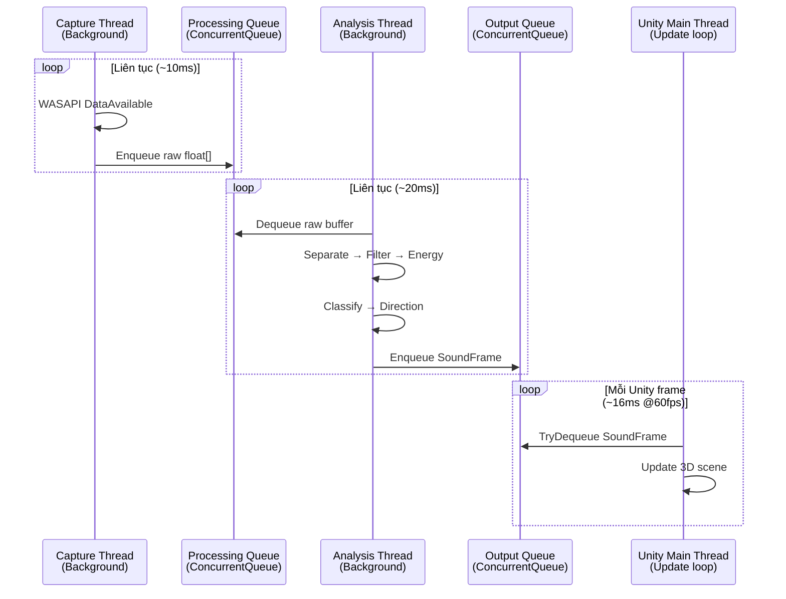
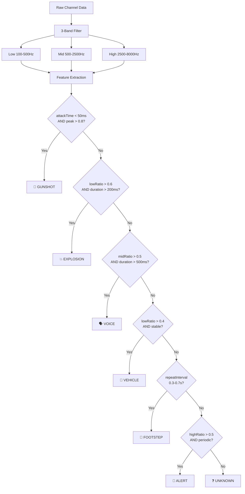
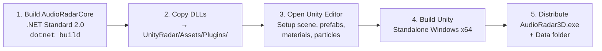

# AudioRadar3D — Implementation Plan (DLL Plugin Architecture)

Phần mềm bắt luồng âm thanh hệ thống, phân loại loại âm thanh, và hiển thị mô phỏng nguồn âm 3D với nhân vật đứng giữa — **tất cả trong 1 Unity app duy nhất**.

---

## Quyết định thiết kế

| Yêu cầu | Quyết định |
|---|---|
| **Kiến trúc** | 1 process — Unity app + `AudioRadarCore.dll` plugin |
| **Hiển thị** | Cửa sổ riêng full-screen |
| **Góc nhìn** | Third-person (camera phía sau nhân vật) |
| **Phân loại âm** | 7 loại: Footstep, Gunshot, Explosion, Voice, Vehicle, Alert, Unknown |
| **Profile** | Lưu cấu hình riêng cho từng ứng dụng/game, auto-detect |
| **Hotkey** | Người dùng tự định nghĩa phím tắt |

---

## Kiến trúc Tổng quan



### Tại sao DLL Plugin tốt hơn 2-Process UDP?

| Tiêu chí | ~~2 Process (UDP)~~ | ✅ DLL Plugin |
|---|---|---|
| RAM | ~100 MB | **~60 MB** (−40%) |
| Latency | ~10ms | **< 1ms** |
| Deploy | 2 file .exe | **1 file .exe** |
| Data transfer | JSON serialize mỗi 20ms | **Direct object reference** |
| Code duplication | Duplicate models | **Shared DLL** |
| User experience | Phải mở 2 app | **Mở 1 app** |

---

## AudioRadarCore.dll — Class Library

> [!IMPORTANT]
> **Target: .NET Standard 2.0** — Tương thích cả Unity (.NET Standard 2.1) và standalone .NET 8.
> 
> Build thành DLL → copy vào `UnityRadar/Assets/Plugins/` cùng với `NAudio.dll`, `NAudio.Core.dll`, `NAudio.Wasapi.dll`.

### Threading Model



> [!WARNING]
> **Quy tắc an toàn thread:**
> - WASAPI callback chạy trên background thread → **KHÔNG** gọi Unity API ở đây
> - Mọi dữ liệu truyền qua `ConcurrentQueue<T>`
> - Unity main thread (`Update()`) dequeue và cập nhật scene
> - NAudio khởi tạo trên dedicated thread riêng (COM STA requirement)

### Data Models (Shared)

```csharp
// ─── SoundType.cs ───
public enum SoundType
{
    Unknown,    // ❓
    Footstep,   // 👣
    Gunshot,    // 🔫
    Explosion,  // 💥
    Voice,      // 🗣️
    Vehicle,    // 🚗
    Alert       // 🔔
}

// ─── SoundEvent.cs ───
public class SoundEvent
{
    public int Id;
    public SoundType Type;
    public float DirectionX, DirectionY, DirectionZ;  // Normalized vector
    public float Intensity;     // 0.0 – 1.0
    public float Distance;      // 0.0 (gần) – 1.0 (xa)
    public float Confidence;    // Độ tin cậy phân loại
}

// ─── SoundFrame.cs ───
public class SoundFrame
{
    public long Timestamp;
    public SoundEvent[] Events;          // Nhiều nguồn âm đồng thời
    public float OverallIntensity;
    public float[] ChannelLevels;        // 8 values (per-channel RMS)
    public string ActiveProfile;
}
```

### Public API của DLL

```csharp
// ─── AudioRadarEngine.cs ─── (Facade / Entry point)
public class AudioRadarEngine : IDisposable
{
    // Khởi tạo
    public AudioRadarEngine(ProfileData profile);
    
    // Điều khiển
    public void Start();                  // Bắt đầu capture + analyze
    public void Stop();                   // Dừng
    public bool IsRunning { get; }
    
    // Lấy kết quả (gọi từ Unity Update)
    public bool TryGetLatestFrame(out SoundFrame frame);
    
    // Cấu hình
    public void ApplyProfile(ProfileData profile);
    public string[] GetAudioDevices();
    public void SetAudioDevice(string deviceId);
    
    // Events
    public event Action<string> OnError;
    public event Action<string> OnDeviceChanged;
    
    // Cleanup
    public void Dispose();
}
```

### Cấu trúc files — AudioRadarCore

```
AudioRadarCore/
├── AudioRadarCore.csproj                    # .NET Standard 2.0
│
├── AudioRadarEngine.cs                      # ★ Public facade API
│
├── Capture/
│   ├── AudioCaptureService.cs               # WASAPI Loopback via NAudio
│   ├── AudioDeviceManager.cs                # Enumerate + select devices
│   └── CaptureThread.cs                     # Dedicated STA thread for COM
│
├── Analyze/
│   ├── ChannelSeparator.cs                  # De-interleave 8 channels
│   ├── BiquadFilter.cs                      # Butterworth IIR band-pass
│   ├── EnergyAnalyzer.cs                    # RMS, peak, spectral features
│   ├── FeatureExtractor.cs                  # Attack time, duration, ZCR, etc.
│   ├── SoundClassifier.cs                   # Rule-based 7-type classification
│   ├── DirectionCalculator.cs               # Weighted direction vector + EMA
│   ├── PeakDetector.cs                      # Detect individual sound onsets
│   └── AnalysisPipeline.cs                  # Full pipeline orchestrator
│
├── Models/
│   ├── SoundType.cs                         # Enum: 7 sound types
│   ├── SoundEvent.cs                        # Single sound event
│   ├── SoundFrame.cs                        # Frame with multiple events
│   ├── ProfileData.cs                       # Profile configuration model
│   ├── FilterBandConfig.cs                  # Per-band filter settings
│   └── ChannelMapping.cs                    # 7.1 channel → angle mapping
│
└── Config/
    └── DefaultProfiles.cs                   # Embedded default profiles
```

---

## Capture — WASAPI Loopback

### Channel Mapping (7.1 Microsoft Standard)

| Index | Kênh | Azimuth | Unit Vector $(x, z)$ |
|---|---|---|---|
| 0 | Front Left (FL) | −30° | $(−0.5,\; 0.866)$ |
| 1 | Front Right (FR) | +30° | $(0.5,\; 0.866)$ |
| 2 | Front Center (FC) | 0° | $(0,\; 1)$ |
| 3 | LFE | — | Bỏ qua |
| 4 | Back Left (BL) | −150° | $(−0.5,\; −0.866)$ |
| 5 | Back Right (BR) | +150° | $(0.5,\; −0.866)$ |
| 6 | Side Left (SL) | −90° | $(−1,\; 0)$ |
| 7 | Side Right (SR) | +90° | $(1,\; 0)$ |

> [!NOTE]
> Dùng tọa độ Unity (x = left/right, z = forward/back, y = up/down). Azimuth 0° = phía trước (z+).

### Khởi tạo trên dedicated thread

```csharp
// CaptureThread.cs — Chạy WASAPI trên STA thread riêng
public class CaptureThread
{
    private Thread _thread;
    private WasapiLoopbackCapture _capture;
    private ConcurrentQueue<float[]> _rawQueue;
    
    public void Start()
    {
        _thread = new Thread(CaptureLoop);
        _thread.SetApartmentState(ApartmentState.STA);  // COM requirement
        _thread.IsBackground = true;
        _thread.Name = "AudioRadar_Capture";
        _thread.Start();
    }
    
    private void CaptureLoop()
    {
        _capture = new WasapiLoopbackCapture();
        _capture.DataAvailable += OnDataAvailable;
        _capture.StartRecording();
        
        // Keep thread alive
        while (_running)
            Thread.Sleep(10);
        
        _capture.StopRecording();
        _capture.Dispose();
    }
    
    private void OnDataAvailable(object sender, WaveInEventArgs e)
    {
        // Convert byte[] → float[] (IEEE Float 32-bit)
        var floats = new float[e.BytesRecorded / 4];
        Buffer.BlockCopy(e.Buffer, 0, floats, 0, e.BytesRecorded);
        _rawQueue.Enqueue(floats);
    }
}
```

---

## Analyze — DSP Pipeline

### Sound Classification Algorithm



### Feature Extraction

| Feature | Công thức | Mục đích |
|---|---|---|
| **RMS Energy** | $\sqrt{\frac{1}{N}\sum x_i^2}$ | Cường độ tổng |
| **Band Ratios** | $\frac{E_{band}}{E_{total}}$ | Phân bố tần số |
| **Attack Time** | Thời gian silence→peak | Gunshot vs Voice |
| **Duration** | Thời gian energy > threshold | Explosion vs Footstep |
| **Spectral Centroid** | $\frac{\sum f_i |X_i|}{\sum |X_i|}$ | "Trọng tâm" tần số |
| **Zero Crossing Rate** | Số lần qua 0 / N | Voice vs Noise |
| **Repeat Interval** | Autocorrelation peaks | Footstep rhythm |
| **Amplitude Variance** | $\text{Var}(RMS_{window})$ | Stable (vehicle) vs dynamic |

### Direction Calculation

$$\vec{D} = \frac{\sum_{i \neq LFE} RMS_i \cdot \vec{P}_i}{\sum_{i \neq LFE} RMS_i}$$

Smoothing (Exponential Moving Average):
$$\vec{D}_{out}(t) = \alpha \cdot \vec{D}(t) + (1 - \alpha) \cdot \vec{D}_{out}(t-1), \quad \alpha \in [0.2, 0.5]$$

---

## Render — Unity App

### Scene Layout (Third-Person View)

```
┌───────────────────────────────────────────────────────┐
│                   FULL-SCREEN WINDOW                  │
│                                                       │
│              💥                    🔫                 │
│               ╲    [Grid Ring 3]  ╱                   │
│                ╲  [Grid Ring 2] ╱                     │
│                 ╲ [Grid Ring 1]╱                      │
│      🗣️ ─────── 🧍 ─────── 👣                       │
│                 ╱    Front    ╲                       │
│                ╱               ╲                      │
│              🚗                 🔔                    │
│                                                       │
│  ╔═══════════════════════════════════════════════╗    │
│  ║ Profile: CS2  │  🟢 Active  │  ⌨️ F9 Toggle  ║    │
│  ╚═══════════════════════════════════════════════╝    │
└───────────────────────────────────────────────────────┘

Camera: Phía sau + trên (offset 0, 5, -8), nhìn vào nhân vật
```

### Sound Source Visualization (7 loại)

| Loại | Visual | Particle | Màu | Lifetime |
|---|---|---|---|---|
| 👣 Footstep | Dấu chân 3D trên ground | Bụi nhẹ | `#66FF66` xanh lá | 0.5s |
| 🔫 Gunshot | Tia flash + muzzle icon | Sparks bắn ra | `#FF6633` cam đỏ | 0.3s |
| 💥 Explosion | Quả cầu lửa + shockwave | Lửa + khói + mảnh | `#FF3300` đỏ | 1.0s |
| 🗣️ Voice | Sóng sin lan tỏa | Soft glow waves | `#3399FF` xanh dương | Liên tục |
| 🚗 Vehicle | Icon xe + vệt trail | Exhaust trail | `#FFCC00` vàng | Liên tục |
| 🔔 Alert | Chuông + ring ripple | Pulse rings | `#CC66FF` tím | 0.8s |
| ❓ Unknown | Chấm sáng generic | Soft pulse | `#AAAAAA` xám | 0.5s |

### Key Unity Scripts

#### [NEW] AudioBridge.cs — Cầu nối DLL ↔ Unity

```csharp
public class AudioBridge : MonoBehaviour
{
    private AudioRadarEngine _engine;
    
    void Start()
    {
        var profile = ProfileManager.LoadActive();
        _engine = new AudioRadarEngine(profile);
        _engine.OnError += msg => Debug.LogError($"[AudioRadar] {msg}");
        _engine.Start();
    }
    
    void Update()
    {
        // Lấy frame mới nhất từ DLL (lock-free, non-blocking)
        if (_engine.TryGetLatestFrame(out SoundFrame frame))
        {
            RadarManager.Instance.ProcessFrame(frame);
        }
    }
    
    void OnDestroy()
    {
        _engine?.Stop();
        _engine?.Dispose();
    }
}
```

#### [NEW] SoundSourceBase.cs — Base class mô phỏng nguồn âm

```csharp
public abstract class SoundSourceBase : MonoBehaviour
{
    public abstract SoundType Type { get; }
    
    // Gọi khi spawn/update
    public void UpdateFromEvent(SoundEvent evt)
    {
        // Vị trí = direction × (1 - distance) × radarRadius
        float radius = GameSettings.RadarRadius;
        float dist = (1f - evt.Distance) * radius;
        
        transform.localPosition = new Vector3(
            evt.DirectionX * dist,
            0.1f,  // Hơi trên mặt đất
            evt.DirectionZ * dist
        );
        
        // Scale theo intensity
        float scale = Mathf.Lerp(0.3f, 1.5f, evt.Intensity);
        transform.localScale = Vector3.one * scale;
        
        // Gọi hiệu ứng riêng của từng loại
        OnUpdateVisual(evt);
    }
    
    protected abstract void OnUpdateVisual(SoundEvent evt);
    public abstract void PlaySpawnEffect();
    public abstract void PlayFadeOut();
}
```

### Cấu trúc files — Unity Project

```
UnityRadar/
├── Assets/
│   ├── Scenes/
│   │   └── RadarScene.unity
│   │
│   ├── Plugins/                              # ★ DLL Plugin folder
│   │   ├── AudioRadarCore.dll                # Compiled từ AudioRadarCore project
│   │   ├── NAudio.dll                        # NAudio .NET Standard 2.0
│   │   ├── NAudio.Core.dll
│   │   └── NAudio.Wasapi.dll
│   │
│   ├── Scripts/
│   │   ├── Core/
│   │   │   ├── AudioBridge.cs                # DLL ↔ Unity bridge (Update loop)
│   │   │   ├── RadarManager.cs               # Main orchestrator
│   │   │   └── GameSettings.cs               # Runtime settings singleton
│   │   │
│   │   ├── Camera/
│   │   │   └── ThirdPersonCamera.cs          # Third-person camera controller
│   │   │
│   │   ├── Character/
│   │   │   └── CharacterSetup.cs             # Humanoid model + idle animation
│   │   │
│   │   ├── SoundSources/
│   │   │   ├── SoundSourceBase.cs            # Abstract base class
│   │   │   ├── FootstepSource.cs             # 👣 Dấu chân + bụi
│   │   │   ├── GunshotSource.cs              # 🔫 Flash + sparks
│   │   │   ├── ExplosionSource.cs            # 💥 Fireball + shockwave
│   │   │   ├── VoiceSource.cs                # 🗣️ Sóng âm lan tỏa
│   │   │   ├── VehicleSource.cs              # 🚗 Icon + trail
│   │   │   ├── AlertSource.cs                # 🔔 Chuông + ripple
│   │   │   ├── UnknownSource.cs              # ❓ Generic glow
│   │   │   └── SoundSourcePool.cs            # Object pooling manager
│   │   │
│   │   ├── Radar/
│   │   │   ├── RadarGrid.cs                  # Procedural grid (circles + lines)
│   │   │   ├── CompassLabels.cs              # Front/Back/Left/Right labels
│   │   │   └── IntensityMeter.cs             # Overall intensity bar
│   │   │
│   │   ├── Profile/
│   │   │   ├── ProfileManager.cs             # Load/save/auto-detect profiles
│   │   │   └── ProcessDetector.cs            # Detect running game processes
│   │   │
│   │   ├── Hotkeys/
│   │   │   ├── HotkeyManager.cs              # Win32 RegisterHotKey wrapper
│   │   │   └── HotkeyConfig.cs               # User keybinding data
│   │   │
│   │   ├── UI/
│   │   │   ├── HUD.cs                        # Status bar (profile, status, hotkey)
│   │   │   ├── SettingsPanel.cs              # In-app settings overlay
│   │   │   ├── ProfileEditor.cs              # Create/edit profiles
│   │   │   ├── HotkeyBinder.cs               # UI for rebinding hotkeys
│   │   │   └── DeviceSelector.cs             # Audio device dropdown
│   │   │
│   │   └── Window/
│   │       └── FullScreenManager.cs          # Multi-monitor full-screen
│   │
│   ├── Materials/
│   │   ├── Ground/
│   │   │   ├── RadarGridMat.mat              # Glowing grid lines
│   │   │   └── GroundMat.mat                 # Dark ground plane
│   │   └── Effects/
│   │       ├── FootstepMat.mat               # Green emissive
│   │       ├── GunshotMat.mat                # Orange/red emissive
│   │       ├── ExplosionMat.mat              # Fire gradient
│   │       ├── VoiceMat.mat                  # Blue emissive
│   │       ├── VehicleMat.mat                # Yellow emissive
│   │       ├── AlertMat.mat                  # Purple emissive
│   │       └── UnknownMat.mat                # Gray emissive
│   │
│   ├── Prefabs/
│   │   ├── SoundSources/
│   │   │   ├── FootstepPrefab.prefab         # Mesh + particle + material
│   │   │   ├── GunshotPrefab.prefab
│   │   │   ├── ExplosionPrefab.prefab
│   │   │   ├── VoicePrefab.prefab
│   │   │   ├── VehiclePrefab.prefab
│   │   │   ├── AlertPrefab.prefab
│   │   │   └── UnknownPrefab.prefab
│   │   ├── RadarGrid.prefab
│   │   └── Character.prefab
│   │
│   ├── Particles/
│   │   ├── DustPuff.prefab                   # Footstep dust
│   │   ├── MuzzleFlash.prefab                # Gunshot flash
│   │   ├── ExplosionFX.prefab                # Explosion fire+smoke
│   │   ├── SoundWave.prefab                  # Voice wave rings
│   │   ├── ExhaustTrail.prefab               # Vehicle exhaust
│   │   └── RingRipple.prefab                 # Alert ripple
│   │
│   ├── Models/
│   │   └── Character/                        # Mixamo humanoid + idle anim
│   │
│   ├── Shaders/
│   │   ├── RadarGlow.shader                  # Bloom/glow (URP)
│   │   ├── GridPulse.shader                  # Animated grid lines
│   │   └── SoundWave.shader                  # Expanding wave rings
│   │
│   └── Resources/
│       └── Profiles/
│           ├── default.json                  # Default profile
│           ├── cs2.json                      # Counter-Strike 2
│           └── valorant.json                 # Valorant
│
├── Packages/manifest.json                    # URP, DOTween, etc.
└── ProjectSettings/
```

---

## Hệ thống Profile

### Cấu trúc Profile JSON

```json
{
  "name": "Counter-Strike 2",
  "processName": "cs2",
  "autoDetect": true,
  
  "filters": {
    "footstep":  { "enabled": true,  "freqLow": 300,  "freqHigh": 800,  "threshold": 0.15 },
    "gunshot":   { "enabled": true,  "freqLow": 500,  "freqHigh": 4000, "threshold": 0.40 },
    "explosion": { "enabled": true,  "freqLow": 30,   "freqHigh": 300,  "threshold": 0.50 },
    "voice":     { "enabled": false, "freqLow": 300,  "freqHigh": 3400, "threshold": 0.20 },
    "vehicle":   { "enabled": false, "freqLow": 50,   "freqHigh": 500,  "threshold": 0.30 },
    "alert":     { "enabled": true,  "freqLow": 1000, "freqHigh": 5000, "threshold": 0.25 }
  },
  
  "display": {
    "radarRadius": 5.0,
    "blipLifetime": 1.5,
    "smoothingAlpha": 0.3,
    "showGrid": true,
    "gridRings": 4,
    "cameraOffset": [0, 5, -8]
  },
  
  "colors": {
    "footstep":  "#66FF66",
    "gunshot":   "#FF6633",
    "explosion": "#FF3300",
    "voice":     "#3399FF",
    "vehicle":   "#FFCC00",
    "alert":     "#CC66FF"
  },
  
  "hotkeys": {
    "toggle":      { "key": "F9",  "modifiers": [] },
    "nextProfile": { "key": "F10", "modifiers": [] },
    "settings":    { "key": "F11", "modifiers": [] }
  }
}
```

### Auto-detect (trong Unity)

```csharp
// ProcessDetector.cs — Chạy mỗi 3 giây
public class ProcessDetector : MonoBehaviour
{
    private float _checkInterval = 3f;
    
    IEnumerator CheckProcesses()
    {
        while (true)
        {
            var processes = Process.GetProcesses()
                .Select(p => p.ProcessName.ToLower())
                .ToHashSet();
            
            var matched = ProfileManager.FindMatchingProfile(processes);
            if (matched != null && matched != ProfileManager.ActiveProfile)
            {
                ProfileManager.SwitchTo(matched);
                // Cập nhật DLL engine với profile mới
                AudioBridge.Instance.Engine.ApplyProfile(matched.Data);
            }
            
            yield return new WaitForSeconds(_checkInterval);
        }
    }
}
```

---

## Hệ thống Hotkey

### Win32 RegisterHotKey trong Unity

```csharp
// HotkeyManager.cs
public class HotkeyManager : MonoBehaviour
{
    [DllImport("user32.dll")]
    static extern bool RegisterHotKey(IntPtr hWnd, int id, uint modifiers, uint vk);
    
    [DllImport("user32.dll")]
    static extern bool UnregisterHotKey(IntPtr hWnd, int id);
    
    private IntPtr _hwnd;
    private Dictionary<int, Action> _callbacks = new();
    
    void Start()
    {
        #if !UNITY_EDITOR
        _hwnd = GetUnityWindowHandle();
        
        // Đăng ký hotkey từ profile
        var config = ProfileManager.ActiveProfile.Hotkeys;
        RegisterFromConfig(config);
        
        // Hook vào Windows message loop
        var source = HwndSource.FromHwnd(_hwnd);
        source.AddHook(WndProc);
        #endif
    }
    
    // Người dùng tùy chỉnh qua UI:
    // 1. Click vào ô "Toggle Hotkey"
    // 2. Nhấn phím mới (VD: Ctrl+Shift+R)
    // 3. Lưu vào profile JSON
    // 4. UnregisterHotKey cũ → RegisterHotKey mới
}
```

---

## Build & Deploy Pipeline



### Build script tự động

```powershell
# build.ps1 — Build toàn bộ project
# Bước 1: Build DLL
dotnet build AudioRadarCore/AudioRadarCore.csproj -c Release

# Bước 2: Copy DLLs sang Unity
$source = "AudioRadarCore/bin/Release/netstandard2.0"
$dest = "UnityRadar/Assets/Plugins"

Copy-Item "$source/AudioRadarCore.dll" $dest -Force
Copy-Item "$source/NAudio.dll" $dest -Force
Copy-Item "$source/NAudio.Core.dll" $dest -Force
Copy-Item "$source/NAudio.Wasapi.dll" $dest -Force

Write-Host "✅ DLLs copied to Unity Plugins folder"
```

---

## Tổng hợp cấu trúc Project

```
d:\Code\1_MyCode\AudioRadar3D\
│
├── AudioRadarCore/                       # ── .NET Standard 2.0 Class Library ──
│   ├── AudioRadarCore.csproj
│   ├── AudioRadarEngine.cs               # ★ Public API (facade)
│   ├── Capture/                          # WASAPI Loopback (3 files)
│   ├── Analyze/                          # DSP + Classification (8 files)
│   ├── Models/                           # Shared data models (6 files)
│   └── Config/                           # Default profiles (1 file)
│
├── AudioRadarCore.Tests/                 # ── xUnit Tests ──
│   ├── AudioRadarCore.Tests.csproj
│   ├── ChannelSeparatorTests.cs
│   ├── BiquadFilterTests.cs
│   ├── SoundClassifierTests.cs
│   └── DirectionCalculatorTests.cs
│
├── UnityRadar/                           # ── Unity 2022 LTS (URP) ──
│   └── Assets/
│       ├── Plugins/                      # ★ DLL files go here
│       ├── Scripts/                      # Unity scripts (20+ files)
│       ├── Materials/                    # Materials (9 files)
│       ├── Prefabs/                      # Prefabs (9 files)
│       ├── Particles/                    # Particle systems (6 files)
│       ├── Models/                       # 3D character
│       ├── Shaders/                      # Custom shaders (3 files)
│       └── Resources/Profiles/           # JSON profiles
│
├── build.ps1                             # Build + copy script
├── AudioRadar3D.sln                      # Solution (DLL + Tests)
├── README.md
└── .gitignore
```

---

## Thứ tự triển khai

### Phase 1 — AudioRadarCore.dll (Tuần 1)
| # | Task | Files |
|---|---|---|
| 1 | Setup .NET Standard 2.0 project + NAudio NuGet | `AudioRadarCore.csproj` |
| 2 | Data models | `Models/*.cs` (6 files) |
| 3 | WASAPI Loopback capture + STA thread | `Capture/*.cs` (3 files) |
| 4 | Channel de-interleave | `ChannelSeparator.cs` |
| 5 | Biquad band-pass filter (3 bands) | `BiquadFilter.cs` |
| 6 | RMS + feature extraction | `EnergyAnalyzer.cs`, `FeatureExtractor.cs` |
| 7 | Direction vector calculation | `DirectionCalculator.cs` |
| 8 | Public API facade | `AudioRadarEngine.cs` |
| 9 | Unit tests | `AudioRadarCore.Tests/*.cs` |

### Phase 2 — Sound Classification + Profiles (Tuần 2)
| # | Task | Files |
|---|---|---|
| 10 | Rule-based classifier | `SoundClassifier.cs` |
| 11 | Peak/onset detector | `PeakDetector.cs` |
| 12 | Full analysis pipeline | `AnalysisPipeline.cs` |
| 13 | Profile data model + defaults | `ProfileData.cs`, `DefaultProfiles.cs` |
| 14 | Classifier unit tests | `SoundClassifierTests.cs` |
| 15 | Build script | `build.ps1` |

### Phase 3 — Unity Radar (Tuần 3–4)
| # | Task | Files |
|---|---|---|
| 16 | Create Unity project (URP) | Project setup |
| 17 | Import DLLs + verify | `Assets/Plugins/` |
| 18 | AudioBridge + RadarManager | `Core/*.cs` |
| 19 | Third-person camera | `ThirdPersonCamera.cs` |
| 20 | Radar grid (procedural) | `RadarGrid.cs`, `CompassLabels.cs` |
| 21 | Character setup | `CharacterSetup.cs` + Mixamo model |
| 22 | 7 sound source types + particles | `SoundSources/*.cs`, `Particles/*.prefab` |
| 23 | Object pooling | `SoundSourcePool.cs` |
| 24 | Materials + shaders | `Materials/`, `Shaders/` |
| 25 | Full-screen manager | `FullScreenManager.cs` |

### Phase 4 — Systems + Polish (Tuần 4)
| # | Task | Files |
|---|---|---|
| 26 | Profile manager + auto-detect | `ProfileManager.cs`, `ProcessDetector.cs` |
| 27 | Hotkey system | `HotkeyManager.cs`, `HotkeyConfig.cs` |
| 28 | Settings UI | `UI/*.cs` (5 files) |
| 29 | HUD status bar | `HUD.cs` |
| 30 | End-to-end testing | Manual testing |
| 31 | Performance optimization | Profiling + fixes |
| 32 | Build standalone .exe | Unity Build |

---

## Verification Plan

### Unit Tests (AudioRadarCore)
```bash
dotnet test AudioRadarCore.Tests/

# ChannelSeparatorTests: 8ch de-interleave chính xác
# BiquadFilterTests: Frequency response pass/reject  
# SoundClassifierTests: Known features → expected SoundType
# DirectionCalculatorTests: Known amplitudes → expected vector
```

### Integration Tests
| Test | Input | Expected |
|---|---|---|
| DLL standalone | Phát nhạc → Console app dùng DLL | SoundFrame output chính xác |
| Unity + DLL | Copy DLL → Unity → Play | Blips xuất hiện trên radar |
| Profile switch | Chạy CS2 → bật app | Auto-detect + load cs2.json |
| Hotkey | Nhấn F9 | Radar toggle on/off |

### Performance Targets
| Metric | Target |
|---|---|
| CPU usage | < 5% |
| RAM | < 80 MB |
| Audio→Display latency | < 20ms |
| Frame rate | 60 FPS stable |
| DLL processing time | < 5ms per frame |
